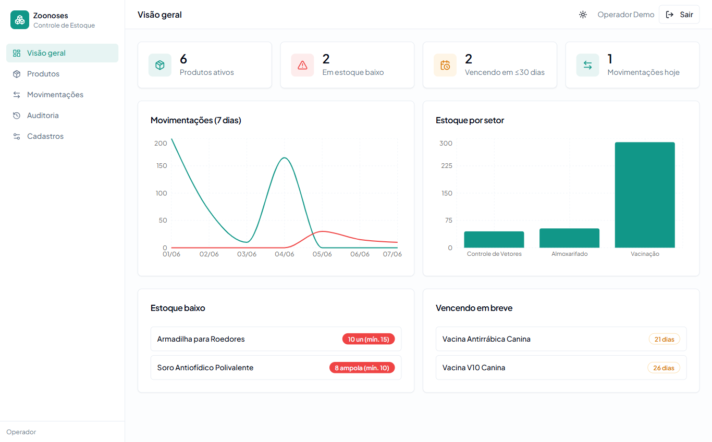

# Zoonoses — Controle de Estoque em Tempo Real


Controle de estoque **multiusuário e em tempo real** para um centro de zoonoses
(vacinas, soros, medicamentos, EPI, material de campo). Uma movimentação
registrada por um operador aparece **na hora** na tela de todos os outros —
sem recarregar a página.

**🔗 Demo ao vivo: [leonardopcavalcanti.github.io/zoonoses-inventory-dashboard](https://leonardopcavalcanti.github.io/zoonoses-inventory-dashboard/)**

> **Conta de demonstração:** `demo@zoonoses.app` · senha `demo-zoonoses-2026`
> (ou clique em **"Entrar como demonstração"**). É um perfil *operador*: registra
> movimentações sem apagar os cadastros base, para o demo sobreviver ao uso público.

[](https://leonardopcavalcanti.github.io/zoonoses-inventory-dashboard/)

---

## O que este projeto ensina

> O ponto central deste projeto é **estado compartilhado em tempo real**: vários
> operadores olhando o mesmo estoque, cada um vendo as ações dos outros
> imediatamente — e o estoque permanecendo correto mesmo sob uso concorrente.

### 1. Tempo real por mudanças no banco (Postgres → WebSocket)
Em vez de *polling* (perguntar ao servidor de tempos em tempos), o cliente
**assina** as mudanças das tabelas via [Supabase Realtime](https://supabase.com/docs/guides/realtime).
O Postgres publica cada `INSERT/UPDATE/DELETE` em uma *replication publication*;
o Supabase entrega esses eventos por WebSocket. No frontend, cada evento
**invalida o cache** do [TanStack Query](https://tanstack.com/query), que re-busca
só o que mudou — daí o painel atualizar sozinho (ver `src/hooks/useRealtime.ts`).

### 2. O estoque é verdade no banco, não na interface
Toda alteração de saldo passa por uma **movimentação** (entrada/saída/ajuste).
Um **trigger** no Postgres aplica a movimentação ao saldo do lote e **rejeita uma
saída maior que o disponível** — a regra vive no banco, então nenhum cliente
(nem um bug de UI, nem dois cliques simultâneos) consegue furá-la. É o mesmo
princípio de **integridade no servidor** de qualquer sistema sério.
Veja `supabase/migrations/*_triggers.sql`.

### 3. Segurança por linha (Row Level Security)
A `anon key` que vai no navegador é **pública por design**. Quem protege os dados
é o **RLS**: políticas no Postgres definem que só usuários autenticados leem, e
que apenas *admins* mexem nos cadastros base. (Você pode confirmar: deslogado,
a API não retorna nenhuma linha.) Veja `supabase/migrations/*_rls.sql`.

### 4. Validade e lotes — modelagem de domínio
Vacinas e medicamentos têm **lote e validade**. O estoque de um produto é a soma
dos seus lotes; os alertas de "vencendo em ≤30 dias" e "estoque baixo" saem de
uma **view** agregada (`vw_estoque_produto`). Modelar o domínio real (e não um
CRUD genérico) é o que torna o sistema de fato útil.

**Leituras de referência:**
- Martin Kleppmann — *Designing Data-Intensive Applications* (estado, consistência, sistemas de dados confiáveis).
- [Supabase Realtime — Postgres Changes](https://supabase.com/docs/guides/realtime/postgres-changes).
- [PostgreSQL — Row Security Policies](https://www.postgresql.org/docs/current/ddl-rowsecurity.html).

---

## Funcionalidades

- **Visão geral:** total de produtos, itens em estoque baixo, lotes vencendo,
  movimentações do dia, gráficos de movimentação (7 dias) e estoque por setor.
- **Produtos & lotes:** CRUD com categoria/fornecedor/setor, estoque mínimo,
  código de lote e validade.
- **Movimentações:** registrar entrada, saída e ajuste — atribuídas ao responsável.
- **Auditoria:** feed cronológico de todas as ações, atualizado ao vivo.
- **Cadastros:** setores, categorias e fornecedores (escrita restrita a admin).
- **Alertas** de estoque baixo e validade próxima; **tema claro/escuro**.

## Stack

- **React 18 + Vite + TypeScript**, **Tailwind CSS** + **shadcn/ui**
- **Supabase** — Postgres, Auth, **Realtime** e RLS (sem servidor próprio)
- **TanStack Query** (cache/sincronização), **Recharts**, **Sonner**
- Deploy: **GitHub Pages** (SPA com HashRouter)

## Arquitetura

```
React (GitHub Pages)  ──HTTPS──>  Supabase PostgREST  ──>  Postgres + RLS + triggers
        │             <──WSS───   Supabase Realtime   <──  publication (postgres_changes)
        └─ TanStack Query: evento de mudança → invalida cache → re-busca → UI ao vivo
```

## Rodar localmente

```bash
npm install
cp .env.example .env     # preencha VITE_SUPABASE_URL e VITE_SUPABASE_ANON_KEY
npm run dev              # http://localhost:8080
```

O schema e os dados de exemplo estão versionados em `supabase/migrations/`.
Com a [Supabase CLI](https://supabase.com/docs/guides/cli): `supabase link` +
`supabase db push` aplica tudo (tabelas, triggers, RLS, Realtime e seed).

---

> Projeto pessoal de Leonardo Cavalcanti. O backend REST original em Express +
> Sequelize permanece em
> [zoonoses-inventory-api](https://github.com/LeonardoPCavalcanti/controle-estoque-zoonoses-api)
> como referência; este demo ao vivo usa Supabase para o tempo real.
